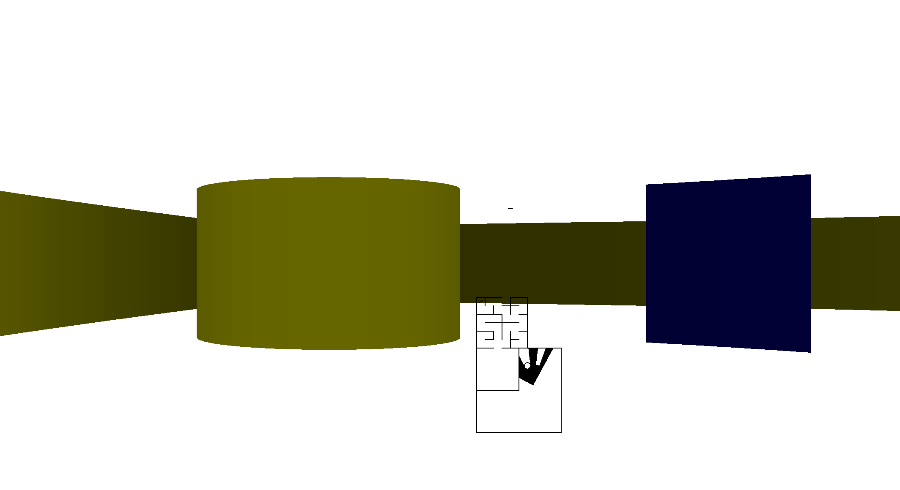

a little passion project
basically a glorified tech demo
just something i made for a school project by myself, and then after turning it in continued to work on it and add features. 

i just wanted to put it here to show it off, and maybe even have people play it. 
This is not made to be pretty. I did not intend for others to read this code. I normally put comments in my code, but here i was the only one that would use it.
so if you read this google, apple, microsoft or something, just know that this is my greatest creation but it isnt my most professional of projects

features:
raycaster that takes line2D.Double objects as map data to make mazes and is able to use pointerLock for player direction and WASD keys for player movement.

SVG parsing - mazegenerator.net allows you to download svg of the maze and my program can parse all of those that only use straight lines and polylines. (currently you are unable to drag and drop map files in, but the program has functions i developed to convert to create the data for the variable that i need to add another map)

circles, keys, doors, colors

CONTROLS
WASD along local axis for movement, move mouse to look around or use the arrow keys.

Scroll wheel or Q key to select a key from the key ring

E to use key on door.

Made with love and suffering, by Zach Beaupre.

